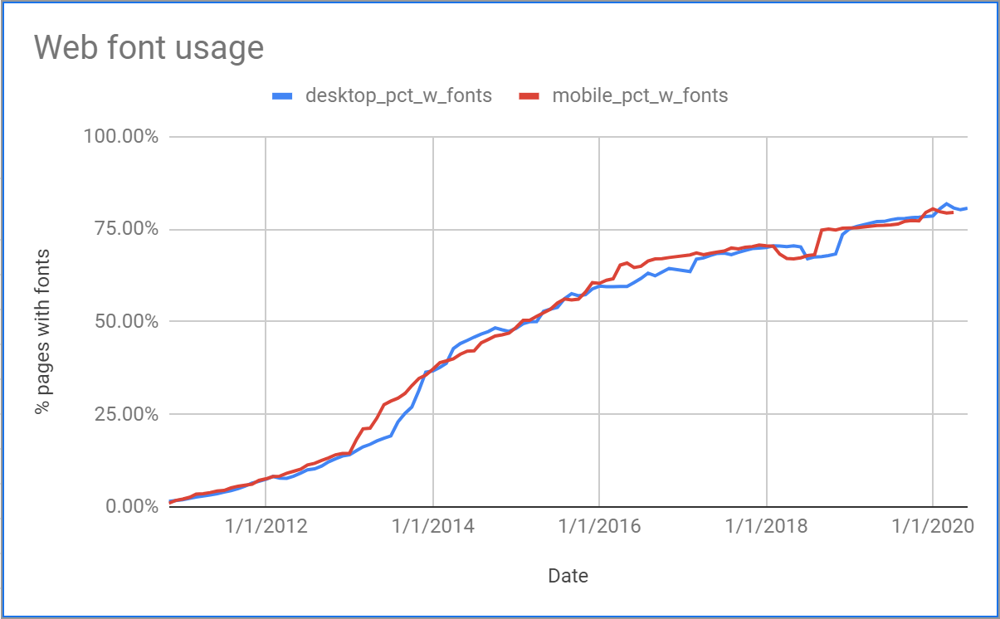
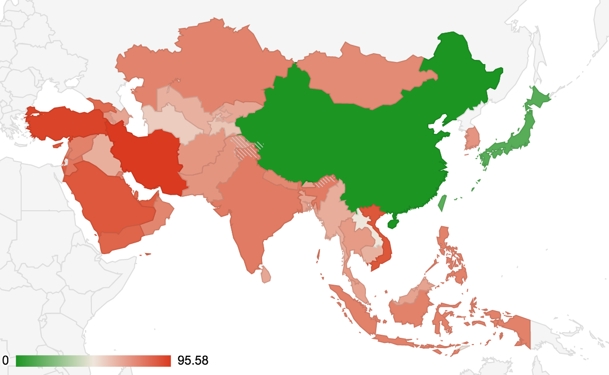

# Progressive Font Enrichment

## Evaluation Report
## 09 August 2020

## Status of this Document

This is an (a draft) Evaluation Report
as required by the charter of the
WebFonts Working Group.
It has not yet been reviewed or approved by that group.
It will eventually be presented to the public
as a report on the investigative activities undertaken
during 2019 and 2020
prior to standardization work.

An Executive Summary is (will be) available.

## Abstract

The success of WebFonts is unevenly distributed.
This study evaluates solutions
which would allow WebFonts to be used
where slow networks,
very large fonts,
or complex subsetting requirements
currently preclude their use.

## Webfont deployment - successes, problems, solutions

### WOFF 1.0

Developed between 2010 and 2012, WOFF 1.0,
which compresses each OpenType table separately with gzip,
was responsible for taking global WebFont usage from 0.1% in 2006
to 35% in 2014.

### WOFF 2.0

Developed between 2014 and 2018, WOFF 2.0,
which significantly improves over WOFF 1.0
by using a font-specific preprocessing step
followed by Brotli compression,
is supported by all browsers
and has taken over from WOFF 1.0.

Global webfont usage is now over 80%.

### Static subsets and unicode-range

CSS has a feature, unicode-range,
which states which characters a font *doesn't* have glyphs for.
This prevents a webfont being needlessly downloaded.

Combined with static subsetting,
this greatly reduces the volume of font data for common, monolinguag websites.
For example, a font which supports Latin, Greek, and Cyrillic
can be split into three subsets;
typically only one will be downloaded.

Google Fonts uses this approach extensively,
and it works well for languages which se only a small number of glyphs.

This study assumes that the target to beat is a static subset font
compressed with the best available method, WOFF 2.0.

### Success: Widespread success for simple fonts

Websites with content languages using the Latin alphabet
(such as Vietnamese, most European and Africal languages),
Greek and Cyrillic alphabets,
and Thai all make modest demands on fonts.
The number of unique characters is limited,
typically under a hundred;
contextual shaping is rare to non-existent,
and thus fonts are easy to subset and compressed font sizes are very small.

Most of the 80% global usage falls into this category.

### Failure: Large glyph repertoires

Languages such as Chinese, Japanese, and Korean
have many thousands of characters.
Font data is thus massive.
While there is statistical variation in usage from character to character,
it is not in general possible to statically subset fonts into
"always used" and "never used" subsets;
the size of the "sometimes used" group predominates.

Static subsetting is unusable,
font sizes are in the megabytes,
and mobile Web usage is significant.

A 2019 study by the HTTP Archive
found that the median number of bytes
used for Web Fonts on websites in China
was *zero*.

### Failure: Difficulty with subsetting

### Solution: Progressive Font Enrichment

Instead of downloading a static subset
(or, where static subsetting cannt work, downloading an entire font),
this proposed solution uses a continuous process of dynamic subsetting.
A small subsetted font is downloaded,
which can display the content currently being browsed.
As the user moves on to other content,
(or as content is added - for example on user forums or with commenting systems)
additional data for that font is automatically downloaded
and te font becomes progressively enriched over time.
In contrast to fine-grained static subsetting,
the CSS remains simple
because the stylesheet sees only a single font,
not a plethora of related fonts.

While this approach has been deployed experimentally
by several font foundries (
Adobe TypeKit,
Monotype,
Google Fonts
),
it is desirable for interoperability
that a standardized solution for Progressive Font Enrichment (PFE) exists.

To ensure that the correct solution is standardized,
which works witha variety of network conditions
and languages
the W3C WebFonts Working group was chartered
to explore the area
and to run simulation experiments on the proposed solution space
before untertaking standards-track work.

## Study Design

### Network type - slow 2G to fast broadband

### Language type: small & simple, complex shaping, large

### Effect of Codepoint Prediction

### Server type: intelligent vs. simple

Two entirely different types of font enrichment have been studied.
They make differing tradeoffs and have correspondingly different advantages and disadvantages.

In one approach "Subset and Patch",
the entire font is dynamically subsetted.
The client and the server communicate closely
to generate the optimal set of enrichment glyphs
and other font information
with each transaction.
A binary patch is used to update the font stored on the client.
This tend more closely towards
the theoretical peak efficiency
in terms of bytes transfered
and minimal network latency,
but requires an intelligent server.
This approach also allows parameters to be adjusted
to maximize efficiency
based on the current network conditions.

In the second approach "Glyph Byterange",
a static subset of the entire font
(but with zero glyph outlines)
is downloaded.
The client then requests glyphs as needed
using standard HTTP byre range requests,
which are supported on all common servers.
The efficiency loss from this approach
depends on the balance of glyph outline data to other font data.
Efficiency is improved if glyphs are re-ordered in terms of statistical occurrence.
This approach allows easier deployment,
because any standard server can be used.
There is no risk of accidentally breaking font rendering
due to mis-subsetting complex tables.
There is no tuning for differing network conditions.

### Complex subsetting: table dependency analysis

### Byterange subsetting: glyph grouping

#### Web page corpus

Is this needed only for the Glyph Byterange case?

### Simulation and analysis framework

### Out of scope

Because this was an experiment,
details of wire protocol
(which would be needed for an interoperable standard)
were not defined at this stage

## Analysis

## Conclusions

## Informative References

PFE-analysis repo
https://github.com/w3c/PFE-analysis

Closure vs Layout:
https://docs.google.com/presentation/d/1qczAiExsuxhtm-0WSlZ0eSiHVOuuq1agTKZTU-26n5k/edit?usp=sharing

Harfbuzz Tech Talk:
https://docs.google.com/presentation/d/1RMkpikAUmdIXaz3eEDYFETWfAwnT0Vw8_oC8Ait5xqs/edit?usp=sharing

Webpage Corpus msg
https://lists.w3.org/Archives/Public/public-webfonts-wg/2019Oct/0011.html
Re: Webpage Corpus
https://lists.w3.org/Archives/Public/public-webfonts-wg/2019Nov/0003.html

Analysis Framework Updates msg
https://lists.w3.org/Archives/Public/public-webfonts-wg/2019Dec/0003.html

Details of our Unicode Range Blocking Algorithm
https://lists.w3.org/Archives/Public/public-webfonts-wg/2020May/0007.html

Progressive Font Enrichment Simulation Results (May 12th, 2020 Data Set)
https://docs.google.com/document/d/1aShjR0-UVoQcu1R9GGPF_Qa3bViOdqYVlk7HM07IdGU/edit#

Progressive Font Enrichment: Codepoint Prediction Results
https://docs.google.com/document/d/1u-05ztF9MqftHbMKB_KiqeUhZKiXNFE4TRSUWFAPXsk/edit#heading=h.l2if29tj434

Subset and Patch Progressive Font Enrichment Protocol Design
https://docs.google.com/document/d/1DJ6VkUEZS2kvYZemIoX4fjCgqFXAtlRjpMlkOvblSts/edit#

WOFF 2.0, the inside scoop
https://www.w3.org/blog/2018/03/woff-2-0-the-inside-scoop/

Happy Birthday Web Fonts!
https://www.w3.org/blog/2020/07/happy-birthday-web-fonts/

How does web font usage vary by country?
https://discuss.httparchive.org/t/how-does-web-font-usage-vary-by-country/1649